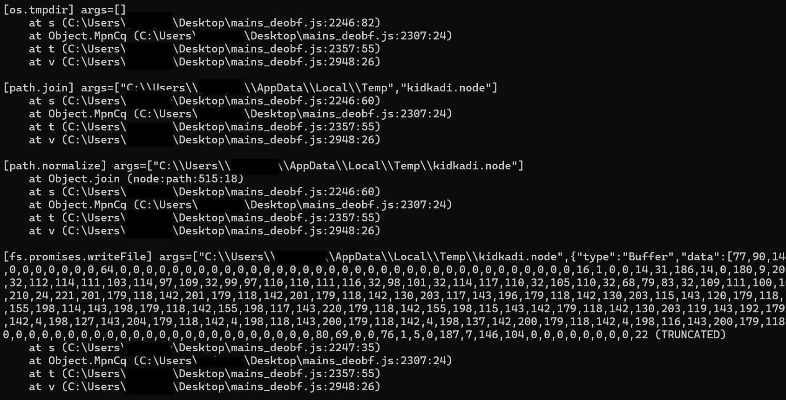

# nodejs-tracer

Simple Node.jstracer that logs calls to core modules, can spoof certain calls to defeat anti-analysis, save files written by the application and more. Useful to analyze heavily obfuscated Node.js malware.

### Usage

```powershell
node -r .\tracer.js main.js
```

Example trace with `DISPLAY_STACK` active:



### Configuration

Adjust the constants in the script to configure the following options:

```js
const DISPLAY_STACK = true // Display stack trace for each call
const SAVE_FILE_WRITES = true // Save files written by the application to the current working directory
const LOG_HTTP_REQUESTS = true // Log HTTP requests to requests.txt
const SKIP_SLEEPS = false // Skip calls to sleep and timers
const TRACE_ERRORS = false // Log errors, caught and uncaught
const IGNORED_APIS = [] // List of APIs that won't be hooked (e.g. ['path.normalize'])
```

Depending on the malware you might need to adjust the anti-anti-VM interceptions on the top of the script.

Currently implements the following anti-anti-VM:

* Spoofs CPU cores
* Spoofs RAM
* Returns empty on call to `tasklist` (if malware tries to enumerate running analysis tools)
* Naively spoofs powershell and wmic output which surprisingly defeats a lot of anti-anti-VM based on e.g. powershell WMI queries
